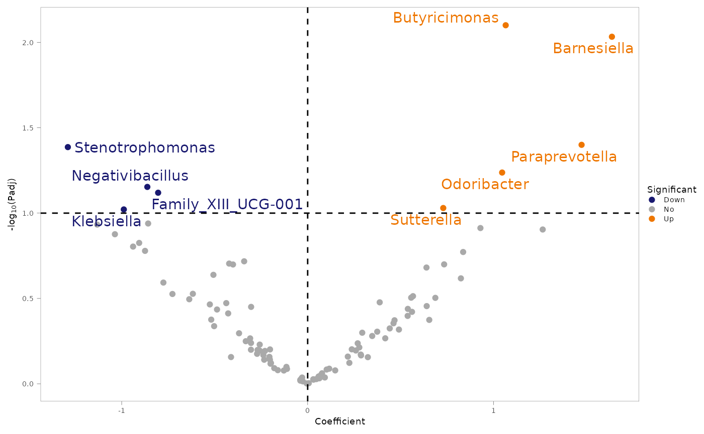
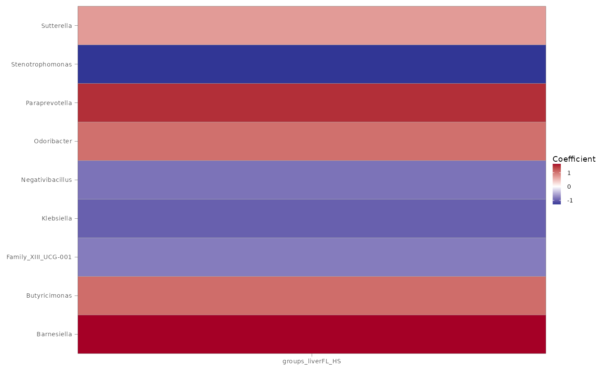
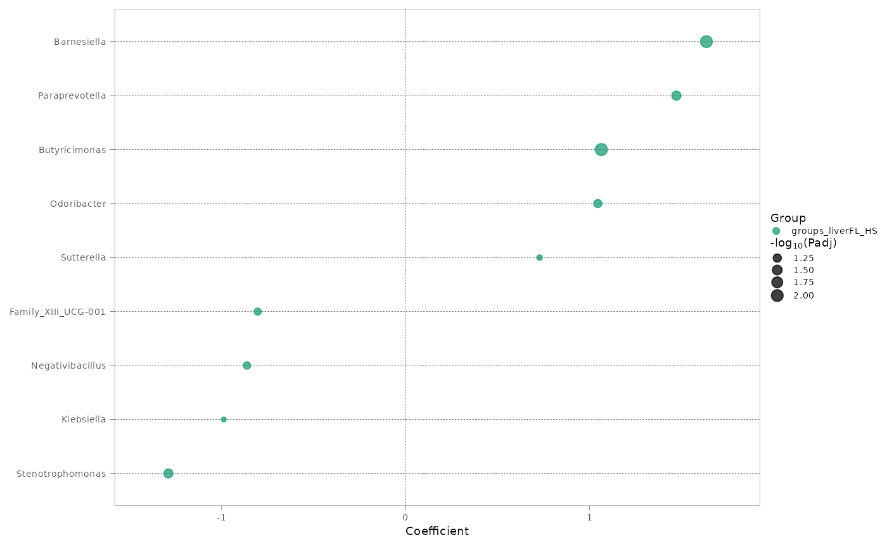
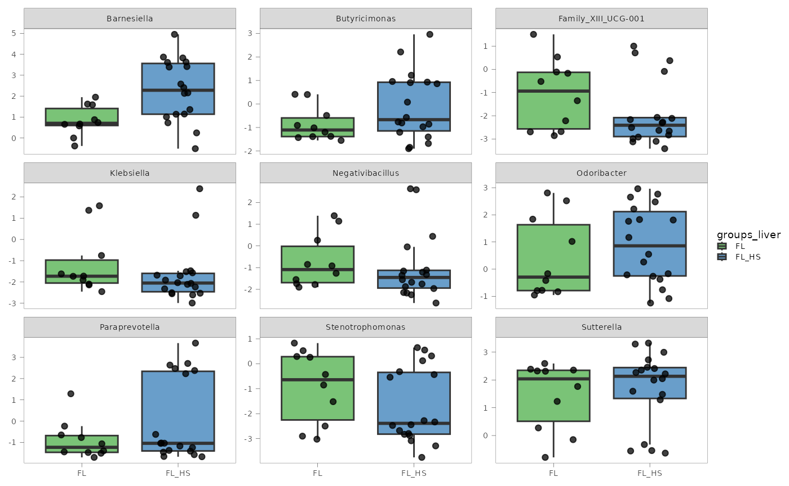
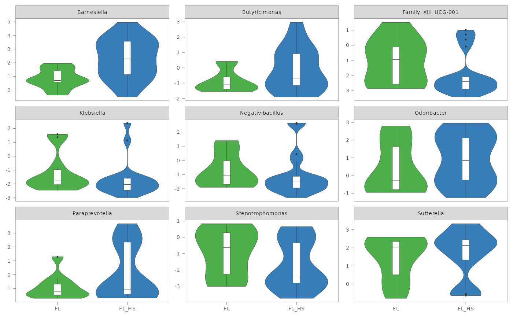
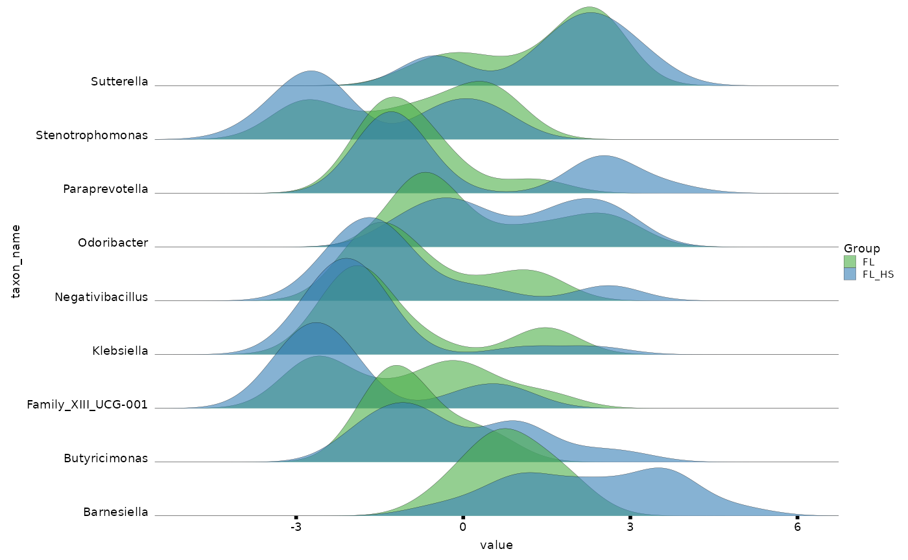

# readyomics

readyomics streamlines single- or multi-omics data analysis pipelines.

The starting input should be a pre-processed raw omics data matrix
(e.g. gene counts, metabolites or protein abundances, etc.) and a table
of related sample information to be used for additional processing and
statistical analysis.

readyomics splits processing and statistical analysis steps into
different functions. This has the following advantages:

- **Aligns with best practice in data science**
  - Avoiding “all-in-one” black-box functions.
  - Processing functions
    ([`process_ngs()`](https://lmartinezgili.github.io/readyomics/reference/process_ngs.md),
    [`process_ms()`](https://lmartinezgili.github.io/readyomics/reference/process_ms.md))
    prepare data.
  - Analysis and visualization functions
    ([`dana()`](https://lmartinezgili.github.io/readyomics/reference/dana.md),
    [`permanova()`](https://lmartinezgili.github.io/readyomics/reference/permanova.md)
    and
    [`ready_plots()`](https://lmartinezgili.github.io/readyomics/reference/ready_plots.md))
    use data ready for modeling.
- **Transparency and troubleshooting**
  - Makes it easy to pinpoint where things go wrong (e.g.,
    transformation *vs.* model error).
  - Encourages users to inspect data at each stage.
- **Supports nonlinear or custom pipelines**
  - Externally-formatted data ⟶ statistical analysis with readyomics.
  - Process raw data with readyomics ⟶ use other downstream analysis
    methods.
- **Scalability**
  - [`dana()`](https://lmartinezgili.github.io/readyomics/reference/dana.md)
    can be set up to run in parallel through
    [`future::plan()`](https://future.futureverse.org/reference/plan.html).
  - `dana` results from multiple omics can be joined, using `platform`
    and `assay` to distinguish results from each dataset.
  - Effortless `dana` results analysis by piping
    [`adjust_pval()`](https://lmartinezgili.github.io/readyomics/reference/adjust_pval.md),
    [`ready_plots()`](https://lmartinezgili.github.io/readyomics/reference/ready_plots.md),
    and (optionally) also
    [`add_feat_name()`](https://lmartinezgili.github.io/readyomics/reference/add_feat_name.md)
    or
    [`add_taxa()`](https://lmartinezgili.github.io/readyomics/reference/add_taxa.md).
- **Future package extensions**
  - New pre-processing strategies.
  - New analysis methods.

## Example

The following example shows the overall workflow of readyomics.

The example data is a 16S rRNA gene sequencing metataxonomics dataset
from human fecal samples. They are a subset of 29 samples from a T2DM
prospective cohort screened for MASLD:

> Forlano, R.\*, Martinez-Gili, L.\*, Takis, P., Miguens-Blanco, J.,
> Liu, T., Triantafyllou, E., … Manousou, P. (2024). Disruption of gut
> barrier integrity and host–microbiome interactions underlie MASLD
> severity in patients with type-2 diabetes mellitus. Gut Microbes,
> 16(1). <https://doi.org/10.1080/19490976.2024.2304157>

Example input files can be found in the `inst/extdata` folder of the
readyomics source, and can be imported using
[`base::system.file()`](https://rdrr.io/r/base/system.file.html) command
as shown below in [Import and inspect data](#import-and-inspect-data).

**Note**: this example is meant to showcase basic package usage. It is
not meant to provide guidelines on suitable study-specific choices for
data processing and analysis.

### Installation

``` r

install.packages("readyomics")
```

### Load the package

``` r

library(readyomics)
```

### Import and inspect data

``` r

# Raw matrix of ASV counts
asv_counts <- read.csv(system.file("extdata", "asv_raw_counts.csv", package = "readyomics"), 
                       check.names = FALSE, 
                       row.names = 1)

# Taxonomy table
taxa <- read.csv(system.file("extdata", "taxonomy.csv", package = "readyomics"), 
                 check.names = FALSE, 
                 row.names = 1)

# Sample data
sample_data <- read.csv(system.file("extdata", "sample_data.csv", package = "readyomics"), 
                        check.names = FALSE, 
                        row.names = 1)
```

``` r

head(asv_counts)
```

|  | RF_029_AKC | RF_055_RJ | RF_061_AJ | RF_071_IT | RF_081_MS | RF_083_SS | RF_089_RT | RF_091_KB | RF_101_HJ | RF_108_RA | RF_110_SE | RF_113_SV | RF_114_NJ | RF_141_AMM | RF_154_SP | RF_158_AK | RF_159_KH | RF_173_DP | RF_175_MS | RF_189_BN | RF_200_KAP | RF_210_RWP | RF_212_FF | RF_219_ME | RF_231_ED | RF_232_HB | RF_233_AN | RF_238_AF | RF_240_EJB |
|:---|---:|---:|---:|---:|---:|---:|---:|---:|---:|---:|---:|---:|---:|---:|---:|---:|---:|---:|---:|---:|---:|---:|---:|---:|---:|---:|---:|---:|---:|
| ASV1 | 140 | 288 | 249 | 201 | 349 | 289 | 633 | 386 | 572 | 498 | 487 | 270 | 220 | 265 | 439 | 395 | 613 | 433 | 317 | 182 | 93 | 13 | 51 | 50 | 122 | 264 | 305 | 296 | 80 |
| ASV2 | 12 | 13 | 3654 | 14 | 28 | 37 | 56 | 12 | 33 | 69 | 73 | 15 | 0 | 0 | 34 | 37 | 1058 | 50 | 46 | 13 | 773 | 0 | 0 | 1270 | 12 | 0 | 0 | 1374 | 711 |
| ASV3 | 34 | 390 | 533 | 297 | 485 | 520 | 1080 | 285 | 850 | 587 | 766 | 542 | 345 | 355 | 411 | 342 | 548 | 827 | 294 | 251 | 194 | 0 | 56 | 79 | 139 | 337 | 215 | 194 | 103 |
| ASV4 | 235 | 67 | 176 | 38 | 164 | 71 | 150 | 74 | 117 | 136 | 96 | 66 | 52 | 247 | 55 | 92 | 225 | 111 | 112 | 106 | 729 | 34 | 685 | 0 | 60 | 71 | 440 | 0 | 543 |
| ASV5 | 88 | 142 | 131 | 99 | 150 | 150 | 300 | 197 | 222 | 262 | 243 | 124 | 83 | 144 | 116 | 182 | 135 | 243 | 84 | 59 | 25 | 0 | 0 | 0 | 44 | 119 | 40 | 86 | 45 |
| ASV6 | 63 | 160 | 248 | 135 | 212 | 272 | 532 | 171 | 371 | 364 | 267 | 218 | 170 | 228 | 164 | 182 | 289 | 392 | 146 | 131 | 38 | 0 | 25 | 31 | 44 | 138 | 98 | 118 | 61 |

``` r

head(taxa)
```

|  | Kingdom | Phylum | Class | Order | Family | Genus | Species |
|:---|:---|:---|:---|:---|:---|:---|:---|
| ASV1 | Bacteria | Bacteroidota | Bacteroidia | Bacteroidales | Bacteroidaceae | Bacteroides | vulgatus |
| ASV2 | Bacteria | Bacteroidota | Bacteroidia | Bacteroidales | Bacteroidaceae | Bacteroides | dorei |
| ASV3 | Bacteria | Proteobacteria | Gammaproteobacteria | Enterobacterales | Enterobacteriaceae | Escherichia/Shigella | Escherichia/Shigella(g)\_unclass. |
| ASV4 | Bacteria | Bacteroidota | Bacteroidia | Bacteroidales | Bacteroidaceae | Bacteroides | uniformis |
| ASV5 | Bacteria | Bacteroidota | Bacteroidia | Bacteroidales | Bacteroidaceae | Bacteroides | vulgatus |
| ASV6 | Bacteria | Firmicutes | Bacilli | Lactobacillales | Streptococcaceae | Streptococcus | Streptococcus(g)\_unclass. |

``` r

head(sample_data)
```

|            | groups_liver | sex | age | PPI | smoking | alcohol_imp |
|:-----------|:-------------|----:|----:|----:|--------:|:------------|
| RF_029_AKC | FL           |   1 |  73 |   1 |       1 | abstinent   |
| RF_055_RJ  | FL_HS        |   2 |  55 |   1 |       2 | abstinent   |
| RF_061_AJ  | FL           |   1 |  71 |   1 |       1 | abstinent   |
| RF_071_IT  | FL_HS        |   1 |  71 |   1 |       2 | moderate    |
| RF_081_MS  | FL           |   1 |  73 |   1 |       1 | excess      |
| RF_083_SS  | FL           |   1 |  70 |   1 |       2 | abstinent   |

### Format sample_data

`sample_data` must include a column named **`sample_id`** with unique
IDs for each sample in the study. For longitudinal studies, `sample_id`
still needs to be unique, therefore a column such as `subject_id` can
then be used to indicate samples coming from the same individual.

The omics `X` data matrix must also use the same `sample_id` labels as
row names, so that they can be matched before analysis. readyomics
always checks sample ID matching.

In addition, categorical variables must be set as factors for downstream
statistical analyses.

``` r

sample_data <- sample_data |>
  dplyr::mutate(sample_id = rownames(sample_data),
         groups_liver = factor(groups_liver, levels = c("FL", "FL_HS")),
         sex = factor(sex),
         PPI = factor(PPI),
         smoking = factor(smoking),
         alcohol_imp = factor(alcohol_imp))
```

### Process data using `process_ngs()`

The choice of processing function will depend on the type of omics being
analysed. We will use
[`process_ngs()`](https://lmartinezgili.github.io/readyomics/reference/process_ngs.md)
in the example, as it is suitable for metataxonomics.

See also
[`process_ms()`](https://lmartinezgili.github.io/readyomics/reference/process_ms.md)
if you need to process mass spectrometry (MS) data like metabolomics or
proteomics.
[`process_ms()`](https://lmartinezgili.github.io/readyomics/reference/process_ms.md)
is compatible with nuclear magnetic resonance spectroscopy (NMR) data,
although with limited processing options.

``` r

# Samples as rows required for process_ngs
asv_counts <- t(asv_counts)

# Process asv_counts data
asv_ready <- process_ngs(X = asv_counts, 
                         sample_data = sample_data, 
                         taxa_table = taxa, 
                         normalise = "none",
                         transform = "clr", 
                         eco_phyloseq = FALSE)
#> The phyloseq object will be built without phylogenetic tree: 'phylo_tree' not provided.
#> 1 samples removed due to zero total read count or < 500 'min_reads'.
#> 28 samples found in common between 28 rows in 'X' and 29 rows in 'sample_data'.
#> 372 out of 2237 features were kept after 10 % prevalence filter.
#> Zeros will be imputed with 'zCompositions::cmultRepl()' prior to clr-transformation.
```

When `verbose = TRUE` we can see that some useful information is printed
in the console (see
[`process_ngs()`](https://lmartinezgili.github.io/readyomics/reference/process_ngs.md)
for all settings and parameters options). For example, that a
phylogenetic tree has not been provided, that 1 sample has been removed
due to falling under the default 500 reads threshold for sequencing
depth, and that 372 features were kept after filtering for 10 %
prevalence.

[`process_ngs()`](https://lmartinezgili.github.io/readyomics/reference/process_ngs.md)
generates a list object that contains:

- The processed matrix `X_processed` (in this case is clr-transformed).
- The matched sample_data (`sdata_final`).
- A `phyloseq_raw` object that contains phyloseq objects for all
  taxonomic ranks (see
  [`build_phyloseq()`](https://lmartinezgili.github.io/readyomics/reference/build_phyloseq.md)
  for more information).
- A `NULL` `phyloseq_eco` object, because counts have not been adjusted
  by microbial load. Counts adjusted by microbial load are no longer
  compositional and they are referred as “ecosystem counts”, hence the
  “\_eco” suffix.

We will see how to apply the processed data for common omics analysis.

### PCA visualisation with `mva()`

``` r

pca <- mva(X = asv_ready$X_processed, 
           sample_data = asv_ready$sdata_final, 
           group_colour = "groups_liver", 
           plot_title = "Beta diversity (Aitchison)")
#> 28 samples found in common between 28 rows in 'X' and 28 rows in 'sample_data'.
#> PCA
#> 28 samples x 372 variables
#> standard scaling of predictors
#>       R2X(cum) pre ort
#> Total    0.533   9   0
```


By default,
[`mva()`](https://lmartinezgili.github.io/readyomics/reference/mva.md)
will show a PCA diagnostics plot, which is very useful to examine
potential outliers, batch effects and clusters related to the groups of
interest.

In addition to storing the
[`ropls::opls()`](https://rdrr.io/pkg/ropls/man/opls.html) object,
[`mva()`](https://lmartinezgili.github.io/readyomics/reference/mva.md)
generates a publication-ready scores plot, in this case color-coded by
the variable `groups_liver` as we indicated:

``` r

pca$scores_plot
```


Because the plot is generated using ggplot2, it can be further tweaked
using ggplot2 functions before export.

### Permutational analysis of variance with `permanova()`

PERMANOVA is quite popular in microbiome datasets to inspect differences
in beta diversity, but it can also be applied to any type of omics data.

By default, the function sets parameter `indenpendent = TRUE`, meaning
[`permanova()`](https://lmartinezgili.github.io/readyomics/reference/permanova.md)
also calculates the overall variance for each covariable in the model
independently, in addition to the
[`vegan::adonis2()`](https://vegandevs.github.io/vegan/reference/adonis.html)
output.

``` r

# Define model
rhs_model <- ~ groups_liver + alcohol_imp + sex + age + PPI + smoking

# Run PERMANOVA
pova <- permanova(X = asv_ready$X_processed, 
                  sample_data = asv_ready$sdata_final,
                  formula_rhs = rhs_model, 
                  platform = "ngs", 
                  assay = "Taxonomy", 
                  seed = 165)
#> Warning in permanova(X = asv_ready$X_processed, sample_data = asv_ready$sdata_final, : 'independent = TRUE' but no variable-specific permutation controls found. Default 'perm_control$joint_terms' will be used.
#> 28 samples found in common between 28 rows in 'X' and 28 rows in 'sample_data'.
#> Permutation parameters for groups_liver have not been specified. Default 'perm_control$joint_terms' will be used.
#> Permutation parameters for alcohol_imp have not been specified. Default 'perm_control$joint_terms' will be used.
#> Permutation parameters for sex have not been specified. Default 'perm_control$joint_terms' will be used.
#> Permutation parameters for age have not been specified. Default 'perm_control$joint_terms' will be used.
#> Permutation parameters for PPI have not been specified. Default 'perm_control$joint_terms' will be used.
#> Permutation parameters for smoking have not been specified. Default 'perm_control$joint_terms' will be used.
```

We see a warning and related verbose message (when `verbose = TRUE`; the
default) about permutation parameters being used for all the variables.
This is because you can set up specific permutation control parameters
for each covariable with `perm_control`. This is particularly useful for
example in longitudinal studies, where you might need to apply
permutation blocks according to certain variables. In our case, we are
good with the default 999 unrestricted random permutations, so we can
ignore the warning and verbose. See
[`permanova()`](https://lmartinezgili.github.io/readyomics/reference/permanova.md)
for more information.

The output is a list that contains the distance matrix and permutation
matrix used, as well as two tables of results `permanova_joint`, which
is the default
[`vegan::adonis2()`](https://vegandevs.github.io/vegan/reference/adonis.html)
result, and `permanova_indep`, when `independent = TRUE`.

``` r

pova$permanova_joint
```

|          |  Df |  SumOfSqs |       R2 |        F | Pr(\>F) | platform | assay    |
|:---------|----:|----------:|---------:|---------:|--------:|:---------|:---------|
| Model    |   8 |  4642.217 | 0.313521 | 1.084683 |    0.09 | ngs      | Taxonomy |
| Residual |  19 | 10164.501 | 0.686479 |       NA |      NA | ngs      | Taxonomy |
| Total    |  27 | 14806.718 | 1.000000 |       NA |      NA | ngs      | Taxonomy |

``` r

pova$permanova_indep
```

|  | Df | SumOfSqs | R2 | F | Pr(\>F) | var_name | platform | assay |
|:---|---:|---:|---:|---:|---:|:---|:---|:---|
| groups_liver.Model | 1 | 461.8705 | 0.0311933 | 0.8371392 | 0.940 | groups_liver | ngs | Taxonomy |
| groups_liver.Residual | 26 | 14344.8473 | 0.9688067 | NA | NA | groups_liver | ngs | Taxonomy |
| groups_liver.Total | 27 | 14806.7179 | 1.0000000 | NA | NA | groups_liver | ngs | Taxonomy |
| alcohol_imp.Model | 2 | 1088.7284 | 0.0735294 | 0.9920627 | 0.499 | alcohol_imp | ngs | Taxonomy |
| alcohol_imp.Residual | 25 | 13717.9895 | 0.9264706 | NA | NA | alcohol_imp | ngs | Taxonomy |
| alcohol_imp.Total | 27 | 14806.7179 | 1.0000000 | NA | NA | alcohol_imp | ngs | Taxonomy |
| sex.Model | 1 | 545.4117 | 0.0368354 | 0.9943482 | 0.439 | sex | ngs | Taxonomy |
| sex.Residual | 26 | 14261.3062 | 0.9631646 | NA | NA | sex | ngs | Taxonomy |
| sex.Total | 27 | 14806.7179 | 1.0000000 | NA | NA | sex | ngs | Taxonomy |
| age.Model | 1 | 527.1507 | 0.0356021 | 0.9598272 | 0.580 | age | ngs | Taxonomy |
| age.Residual | 26 | 14279.5672 | 0.9643979 | NA | NA | age | ngs | Taxonomy |
| age.Total | 27 | 14806.7179 | 1.0000000 | NA | NA | age | ngs | Taxonomy |
| PPI.Model | 1 | 653.3245 | 0.0441235 | 1.2001672 | 0.098 | PPI | ngs | Taxonomy |
| PPI.Residual | 26 | 14153.3934 | 0.9558765 | NA | NA | PPI | ngs | Taxonomy |
| PPI.Total | 27 | 14806.7179 | 1.0000000 | NA | NA | PPI | ngs | Taxonomy |
| smoking.Model | 2 | 1421.2488 | 0.0959868 | 1.3272310 | 0.007 | smoking | ngs | Taxonomy |
| smoking.Residual | 25 | 13385.4691 | 0.9040132 | NA | NA | smoking | ngs | Taxonomy |
| smoking.Total | 27 | 14806.7179 | 1.0000000 | NA | NA | smoking | ngs | Taxonomy |

### *D*ifferential *ANA*lysis with `dana()`

A common analysis goal with omics data is to try and find omic features
associated with traits of interest.
[`dana()`](https://lmartinezgili.github.io/readyomics/reference/dana.md)
is readyomics function for differential analysis. At present,
[`dana()`](https://lmartinezgili.github.io/readyomics/reference/dana.md)
supports linear regressions with
[`stats::lm()`](https://rdrr.io/r/stats/lm.html) and linear mixed
effects models with
[`lme4::lmer()`](https://rdrr.io/pkg/lme4/man/lmer.html).
[`dana()`](https://lmartinezgili.github.io/readyomics/reference/dana.md)
main strengths are:

- Full flexibility on model formula (random effects, interaction terms).

- Likelihood ratio tests (LRT) in addition to coefficient P values.

  - LRT is especially recommended for small studies (approx. below 100
    samples).
  - Any formula terms can be tested with LRT (interaction terms, random
    effects).
  - Several terms can be tested at once
    (e.g. `term_LRT = c("sex" , "BMI", "1 | country")`).

- Easy set up to run in parallel using
  [`future::plan()`](https://future.futureverse.org/reference/plan.html) -
  user has full control, allowing good scalability for big data.

- Toggable progress bar with progressr.

We will fit a linear regression with the main variables in our dataset:

``` r

# future::plan(multisession, workers = 4) # For running 4 processes in parallel
# progressr::handlers(global = TRUE) # To show progress bar
dana_asv <- dana(X = asv_ready$X_processed, 
                 sample_data = asv_ready$sdata_final,
                 formula_rhs = rhs_model, 
                 term_LRT = "groups_liver",
                 platform = "ngs")
#> Warning in dana(X = asv_ready$X_processed, sample_data = asv_ready$sdata_final, : Set 'future::plan' parallel strategy to speed up computation.
#> 28 samples found in common between 28 rows in 'X' and 28 rows in 'sample_data'.
#> Using model: stats::lm.
# plan(sequential) # To disable parallel processing
```

We first see a warning message suggesting to use parallel computing due
to the `X` matrix having more than 100 features. However this can be
ignored as [`stats::lm()`](https://rdrr.io/r/stats/lm.html) is very
quick anyway.

The
[`dana()`](https://lmartinezgili.github.io/readyomics/reference/dana.md)
function generates a `dana` object including the input data used, and
the publication-ready `fit` table summarizing the main model results for
each feature analysed (`"feat_id"` column).

``` r

head(dana_asv$fit)
```

| Coefficient | Estimate | Std. Error | t value | Pr(\>\|t\|) | 2.5 % | 97.5 % | feat_id | platform |
|:---|---:|---:|---:|---:|---:|---:|:---|:---|
| (Intercept) | 5.7417549 | 0.9926354 | 5.7843541 | 0.0000142 | 3.6641450 | 7.8193648 | ASV1 | ngs |
| groups_liverFL_HS | 0.2230096 | 0.2429450 | 0.9179426 | 0.3701552 | -0.2854802 | 0.7314994 | ASV1 | ngs |
| alcohol_impexcess | -0.0880760 | 0.4729165 | -0.1862400 | 0.8542306 | -1.0779017 | 0.9017497 | ASV1 | ngs |
| alcohol_impmoderate | -0.1708858 | 0.4263501 | -0.4008109 | 0.6930308 | -1.0632467 | 0.7214752 | ASV1 | ngs |
| sex2 | -0.4434339 | 0.2604760 | -1.7023984 | 0.1049857 | -0.9886163 | 0.1017486 | ASV1 | ngs |
| age | -0.0102866 | 0.0147685 | -0.6965206 | 0.4945367 | -0.0411974 | 0.0206243 | ASV1 | ngs |

If working with multiple omics, is useful to also specify `platform` and
`assay` columns for seamless downstream omics results integration.

When one or more terms are specified for likelihood ratio testing with
`term_LRT`, `dana` also includes the `lrt` table with the LRT results.
In our case we used LRT to test `groups_liver`.

``` r

head(dana_asv$lrt)
```

| Res.Df |       RSS |  Df | Sum of Sq |         F |   Pr(\>F) | term         | feat_id | platform |
|-------:|----------:|----:|----------:|----------:|----------:|:-------------|:--------|:---------|
|     20 |  6.641948 |  NA |        NA |        NA |        NA | groups_liver | ASV1    | ngs      |
|     19 |  6.359897 |   1 | 0.2820509 | 0.8426186 | 0.3701552 | groups_liver | ASV1    | ngs      |
|     20 | 70.044952 |  NA |        NA |        NA |        NA | groups_liver | ASV2    | ngs      |
|     19 | 69.880252 |   1 | 0.1647003 | 0.0447810 | 0.8346607 | groups_liver | ASV2    | ngs      |
|     20 |  8.220301 |  NA |        NA |        NA |        NA | groups_liver | ASV3    | ngs      |
|     19 |  8.044147 |   1 | 0.1761536 | 0.4160687 | 0.5266180 | groups_liver | ASV3    | ngs      |

#### Adjusting for multiple comparisons with `adjust_pval()`

We leverage R base pipes to conveniently add adjusted P values to the
`dana` object results with
[`adjust_pval()`](https://lmartinezgili.github.io/readyomics/reference/adjust_pval.md).

``` r

dana_asv <- dana_asv |>
  adjust_pval(padj_by = "terms", 
              padj_method = "BH", 
              padj_method_LRT = "BH")
```

The `fit` table now has new columns with the adjusted P values. Because
we chose to adjust by terms in the `fit` table (`padj_by = "terms"`),
this will adjust each covariable P value individually. We see more than
one column of adjusted P values with the format
`padj_[`*`padj_method`*`]_[`*`term`*`]` (e.g. `"padj_BH_sex2"`).

The alternative would be (`padj_by = "all"`) in which all nominal P
values in `fit` will be adjusted together. In this case, a single column
would be added to `fit`, with the format `padj_[`*`padj_method`*`]`.

If a formula fixed term was also tested via LRT,
[`adjust_pval()`](https://lmartinezgili.github.io/readyomics/reference/adjust_pval.md)
will also add the adjusted LRT P value to the `fit` table. LRT P values
have the `"_LRT"` suffix (see last column `"padj_BH_groups_liver_LRT"`).

``` r

head(dana_asv$fit)
```

| Coefficient | Estimate | Std. Error | t value | Pr(\>\|t\|) | 2.5 % | 97.5 % | feat_id | platform | padj_BH_groups_liverFL_HS | padj_BH_alcohol_impexcess | padj_BH_alcohol_impmoderate | padj_BH_sex2 | padj_BH_age | padj_BH_PPI2 | padj_BH_smoking2 | padj_BH_smoking3 | padj_BH_groups_liver_LRT |
|:---|---:|---:|---:|---:|---:|---:|:---|:---|---:|---:|---:|---:|---:|---:|---:|---:|---:|
| (Intercept) | 5.7417549 | 0.9926354 | 5.7843541 | 0.0000142 | 3.6641450 | 7.8193648 | ASV1 | ngs | NA | NA | NA | NA | NA | NA | NA | NA | NA |
| groups_liverFL_HS | 0.2230096 | 0.2429450 | 0.9179426 | 0.3701552 | -0.2854802 | 0.7314994 | ASV1 | ngs | 0.9252859 | NA | NA | NA | NA | NA | NA | NA | 0.9252859 |
| alcohol_impexcess | -0.0880760 | 0.4729165 | -0.1862400 | 0.8542306 | -1.0779017 | 0.9017497 | ASV1 | ngs | NA | 0.9986091 | NA | NA | NA | NA | NA | NA | NA |
| alcohol_impmoderate | -0.1708858 | 0.4263501 | -0.4008109 | 0.6930308 | -1.0632467 | 0.7214752 | ASV1 | ngs | NA | NA | 0.955298 | NA | NA | NA | NA | NA | NA |
| sex2 | -0.4434339 | 0.2604760 | -1.7023984 | 0.1049857 | -0.9886163 | 0.1017486 | ASV1 | ngs | NA | NA | NA | 0.8523934 | NA | NA | NA | NA | NA |
| age | -0.0102866 | 0.0147685 | -0.6965206 | 0.4945367 | -0.0411974 | 0.0206243 | ASV1 | ngs | NA | NA | NA | NA | 0.9220974 | NA | NA | NA | NA |

Similarly, we can inspect the `lrt` table with the added adjusted P
values.

``` r

head(dana_asv$lrt)
```

| Res.Df | RSS | Df | Sum of Sq | F | Pr(\>F) | term | feat_id | platform | padj_BH_groups_liver |
|---:|---:|---:|---:|---:|---:|:---|:---|:---|---:|
| 20 | 6.641948 | NA | NA | NA | NA | groups_liver | ASV1 | ngs | NA |
| 19 | 6.359897 | 1 | 0.2820509 | 0.8426186 | 0.3701552 | groups_liver | ASV1 | ngs | 0.9252859 |
| 20 | 70.044952 | NA | NA | NA | NA | groups_liver | ASV2 | ngs | NA |
| 19 | 69.880252 | 1 | 0.1647003 | 0.0447810 | 0.8346607 | groups_liver | ASV2 | ngs | 0.9949226 |
| 20 | 8.220301 | NA | NA | NA | NA | groups_liver | ASV3 | ngs | NA |
| 19 | 8.044147 | 1 | 0.1761536 | 0.4160687 | 0.5266180 | groups_liver | ASV3 | ngs | 0.9379068 |

While a single adjustment method should be chosen *a priori*, it is
possible to add more than one P value adjustment method
(e.g. `padj_method = c("BH", "storey")`,
`padj_method_LRT = c("BH", "bonferroni")`). See
[`adjust_pval()`](https://lmartinezgili.github.io/readyomics/reference/adjust_pval.md)
for more information.

#### Adding feature labels with `add_feat_name()` or `add_taxa()`

Original labels for some omics data can contain non-alphanumeric
characters and symbols that could be problematic to fit
[`dana()`](https://lmartinezgili.github.io/readyomics/reference/dana.md)
models.
[`process_ms()`](https://lmartinezgili.github.io/readyomics/reference/process_ms.md)
allows to rename features as `"feat_1"`, `"feat_2"`, and so on, by
setting `rename_feat = TRUE`, while storing the original labels.

[`add_feat_name()`](https://lmartinezgili.github.io/readyomics/reference/add_feat_name.md)
can then be used to add the original labels to the `dana` object before
plotting significant results.

Similarly, for metataxonomics and metagenomics data, it is more
interesting to read the genus/species/strain of origin rather than a
cryptic `"ASV1"`. In this case, we would use
[`add_taxa()`](https://lmartinezgili.github.io/readyomics/reference/add_taxa.md).
Which also adds the corresponding higher hierarchy taxa names.

``` r

dana_asv <- dana_asv |>
  add_taxa(taxa_table = taxa, 
           taxa_rank = "asv")
```

We can see that various columns have been added to the `fit` table.
Because `taxa_rank = "asv"`, the column for the feature label
`taxon_name` by default adds the species (if provided) or the genus name
to the ASV ID, collapsed by “\_“, a format quite common in publication
plots.

``` r

head(dana_asv$fit)
```

| Coefficient | Estimate | Std. Error | t value | Pr(\>\|t\|) | 2.5 % | 97.5 % | feat_id | platform | padj_BH_groups_liverFL_HS | padj_BH_alcohol_impexcess | padj_BH_alcohol_impmoderate | padj_BH_sex2 | padj_BH_age | padj_BH_PPI2 | padj_BH_smoking2 | padj_BH_smoking3 | padj_BH_groups_liver_LRT | taxon_rank | taxon_name | species | genus | family | order | class | phylum |
|:---|---:|---:|---:|---:|---:|---:|:---|:---|---:|---:|---:|---:|---:|---:|---:|---:|---:|:---|:---|:---|:---|:---|:---|:---|:---|
| (Intercept) | 5.7417549 | 0.9926354 | 5.7843541 | 0.0000142 | 3.6641450 | 7.8193648 | ASV1 | ngs | NA | NA | NA | NA | NA | NA | NA | NA | NA | asv | vulgatus_ASV1 | vulgatus | Bacteroides | Bacteroidaceae | Bacteroidales | Bacteroidia | Bacteroidota |
| groups_liverFL_HS | 0.2230096 | 0.2429450 | 0.9179426 | 0.3701552 | -0.2854802 | 0.7314994 | ASV1 | ngs | 0.9252859 | NA | NA | NA | NA | NA | NA | NA | 0.9252859 | asv | vulgatus_ASV1 | vulgatus | Bacteroides | Bacteroidaceae | Bacteroidales | Bacteroidia | Bacteroidota |
| alcohol_impexcess | -0.0880760 | 0.4729165 | -0.1862400 | 0.8542306 | -1.0779017 | 0.9017497 | ASV1 | ngs | NA | 0.9986091 | NA | NA | NA | NA | NA | NA | NA | asv | vulgatus_ASV1 | vulgatus | Bacteroides | Bacteroidaceae | Bacteroidales | Bacteroidia | Bacteroidota |
| alcohol_impmoderate | -0.1708858 | 0.4263501 | -0.4008109 | 0.6930308 | -1.0632467 | 0.7214752 | ASV1 | ngs | NA | NA | 0.955298 | NA | NA | NA | NA | NA | NA | asv | vulgatus_ASV1 | vulgatus | Bacteroides | Bacteroidaceae | Bacteroidales | Bacteroidia | Bacteroidota |
| sex2 | -0.4434339 | 0.2604760 | -1.7023984 | 0.1049857 | -0.9886163 | 0.1017486 | ASV1 | ngs | NA | NA | NA | 0.8523934 | NA | NA | NA | NA | NA | asv | vulgatus_ASV1 | vulgatus | Bacteroides | Bacteroidaceae | Bacteroidales | Bacteroidia | Bacteroidota |
| age | -0.0102866 | 0.0147685 | -0.6965206 | 0.4945367 | -0.0411974 | 0.0206243 | ASV1 | ngs | NA | NA | NA | NA | 0.9220974 | NA | NA | NA | NA | asv | vulgatus_ASV1 | vulgatus | Bacteroides | Bacteroidaceae | Bacteroidales | Bacteroidia | Bacteroidota |

#### Visualise results with `ready_plots()`

We can pipe
[`ready_plots()`](https://lmartinezgili.github.io/readyomics/reference/ready_plots.md)
to the previous command, or skip the previous step and directly apply
[`ready_plots()`](https://lmartinezgili.github.io/readyomics/reference/ready_plots.md)
to the `dana` object to explore the results with the default feature IDs
(`"feat_id"` column).

[`ready_plots()`](https://lmartinezgili.github.io/readyomics/reference/ready_plots.md)
automatically generates and stores the most commonly used
publication-ready plots:

- Differential analysis significant coefficients (volcano, dotplot,
  heatmap - capped at 50 features),
- Significant features abundance (capped at the 10 most significant, but
  plots for specific features can be requested with `X_colnames`
  parameter).

``` r

# Generates warning due to lack of significant features:
dana_asv <- dana_asv |>
  ready_plots(term_name = "groups_liver", # Formula fit term of interest
              pval_match = "groups_liver_LRT", # LRT adjusted P values will be used
              sdata_var = "groups_liver", # Grouping variable for individual feature plots
              group_colours = c(FL = "#4daf4a", # Optional color customization
                                FL_HS = "#377eb8"))
#> Warning in ready_plots(dana_asv, term_name = "groups_liver", pval_match = "groups_liver_LRT", : No significant results at selected 0.1 significance threshold. No coefficient or feature plots will be generated.
```

In our example, no features were significant after multiple comparison
correction. This prompts a warning message from
[`ready_plots()`](https://lmartinezgili.github.io/readyomics/reference/ready_plots.md)
which returns the `dana` object with an empty plots list. This is
somewhat expected as we are using a small portion of the original
dataset as a toy example.

A formal analysis would end here, concluding that the null hypothesis
could not be rejected. In our case, we will use the nominal P value to
showcase the
[`ready_plots()`](https://lmartinezgili.github.io/readyomics/reference/ready_plots.md)
functionality.

``` r

dana_asv <- dana_asv |>
  ready_plots(term_name = "groups_liver",
              pval_match = "Pr", # Nominal P value for illustration purposes
              sdata_var = "groups_liver", 
              group_colours = c(FL = "#4daf4a", 
                                FL_HS = "#377eb8"))
#> 33 significant results found at selected 0.1 significance threshold.
#> 'X_colnames' = NULL: the first 10 most significant features will be plotted.
```

When `verbose = TRUE` (the default)
[`ready_plots()`](https://lmartinezgili.github.io/readyomics/reference/ready_plots.md)
displays the total number of significant features at the chosen P value
threshold. We can inspect all plots at once by simply running:

``` r

dana_asv$plots
#> $coeff_volcano
#> Warning: Removed 339 rows containing missing values or values outside the scale range
#> (`geom_text_repel()`).
```


    #> 
    #> $coeff_heatmap


    #> 
    #> $coeff_point


    #> 
    #> $feat_boxplot


    #> 
    #> $feat_violin


    #> 
    #> $feat_ridge
    #> Picking joint bandwidth of 0.471


Because plots are generated with ggplot2, they can easily be further
customized.

### Bonus (microbiome): `dana()` for alpha diversity

``` r

# Compute alpha diversity measures for the ASV phyloseq object
alpha <- phyloseq::estimate_richness(asv_ready$phyloseq_raw$asv) |>
  dplyr::select(-matches("ace|chao|fisher")) |>
  scale()

# Calculate alpha diversity differences among groups with dana()
dana_alpha <- dana(X = alpha, 
                   sample_data = asv_ready$sdata_final,
                   formula_rhs = rhs_model, 
                   term_LRT = "groups_liver",
                   platform = "ngs")
#> 28 samples found in common between 28 rows in 'X' and 28 rows in 'sample_data'.
#> Using model: stats::lm.
```

### Bonus (microbiome): `dana()` for higher taxonomic ranks

The following example shows only the code for genus rank, but this code
could be easily wrapped into a function that iterates across all taxa
ranks to analyse all at once, using parallel computation with
[`future::plan()`](https://future.futureverse.org/reference/plan.html).

``` r

# CLR-transform genus rank counts table
genus_ready <- process_ngs(X = as.data.frame(asv_ready$phyloseq_raw$genus@otu_table), 
                           sample_data = asv_ready$sdata_final, 
                           taxa_table = taxa, 
                           normalise = "none",
                           transform = "clr",
                           raw_phyloseq = FALSE,
                           eco_phyloseq = FALSE,
                           verbose = FALSE)

# Run dana
dana_genus <- dana(X = genus_ready$X_processed, 
                   sample_data = genus_ready$sdata_final,
                   formula_rhs = rhs_model, 
                   term_LRT = "groups_liver",
                   platform = "ngs") |>
  adjust_pval(padj_by = "terms", 
              padj_method = "BH", 
              padj_method_LRT = "BH") |>
  add_taxa(taxa_table = taxa, 
           taxa_rank = "genus") |>
  ready_plots(term_name = "groups_liver",
              pval_match = "Pr", # Nominal P value for illustration purposes
              sdata_var = "groups_liver",
              group_colours = c(FL = "#4daf4a",
                                FL_HS = "#377eb8"))
#> Warning in dana(X = genus_ready$X_processed, sample_data = genus_ready$sdata_final, : Set 'future::plan' parallel strategy to speed up computation.
#> 28 samples found in common between 28 rows in 'X' and 28 rows in 'sample_data'.
#> Using model: stats::lm.
#> 9 significant results found at selected 0.1 significance threshold.
#> 'X_colnames' = NULL: the first 10 most significant features will be plotted.

# Inspect plots
dana_genus$plots
#> $coeff_volcano
#> Warning: Removed 97 rows containing missing values or values outside the scale range
#> (`geom_text_repel()`).
```



    #> 
    #> $coeff_heatmap



    #> 
    #> $coeff_point



    #> 
    #> $feat_boxplot



    #> 
    #> $feat_violin



    #> 
    #> $feat_ridge
    #> Picking joint bandwidth of 0.595


